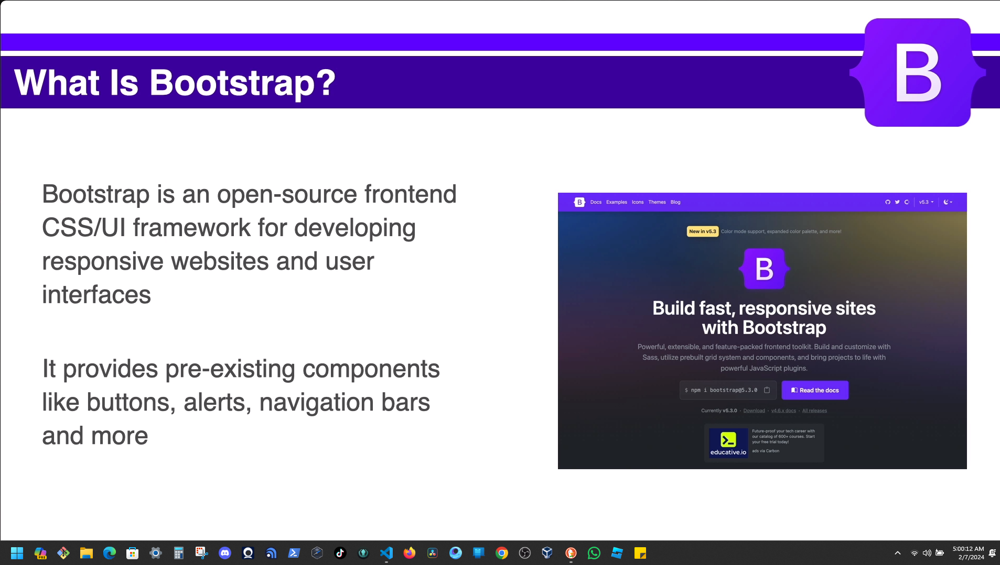
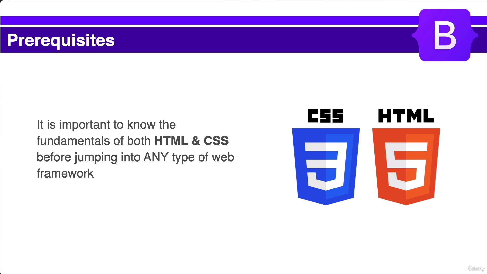
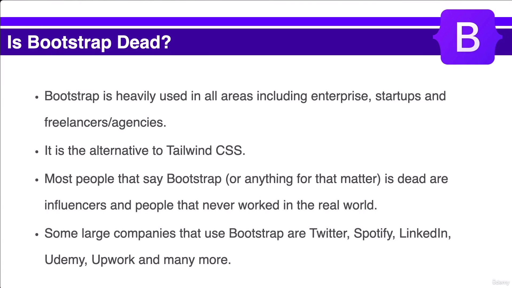

# Section 1: Getting Started.
## What is Bootstrap?





## How to use Bootstrap 
```HTML
<!DOCTYPE html>
<html lang="en">
<head>
    <meta charset="UTF-8">
    <meta name="viewport" content="width=device-width, initial-scale=1.0">
    <!-- CSS Portion -->
    <link href="https://cdn.jsdelivr.net/npm/bootstrap@5.3.2/dist/css/bootstrap.min.css" rel="stylesheet" integrity="sha384-T3c6CoIi6uLrA9TneNEoa7RxnatzjcDSCmG1MXxSR1GAsXEV/Dwwykc2MPK8M2HN" crossorigin="anonymous">
    <title>J's Knowledge Hub</title>
</head>
<body>
    <!-- Javascript portion down below -->
  <script src="https://cdn.jsdelivr.net/npm/bootstrap@5.3.2/dist/js/bootstrap.bundle.min.js" integrity="sha384-C6RzsynM9kWDrMNeT87bh95OGNyZPhcTNXj1NW7RuBCsyN/o0jlpcV8Qyq46cDfL" crossorigin="anonymous"></script>
</body>
</html>
```
## Basic Environment Setup
[Visual Studio Code](https://code.visualstudio.com/download)
[Node js](https://nodejs.org/en)
[Git&Github](https://git-scm.com/downloads) 
<table>
    <thead>
    </thead>
    <tbody>
      <tr>
        <td>Visual Studio</br> 
        Extensions</td>
        <td>
          <ul>
            <li>Live Server</li>
            <li>Prettier - Code Formatter</li>
          </ul>
      </td>
      </tr>
      <tr>
        <td>Settings</td>
        <td>
          <ul>
            <li>Search: format</li>
            <li>Editor: Format on save = check</li>
            <li>Prettier: Semi = Whether to add a semicolon at the end of every line = check.</li>
          </ul>
      </td>
      </tr>
    </tbody>
</table> 
