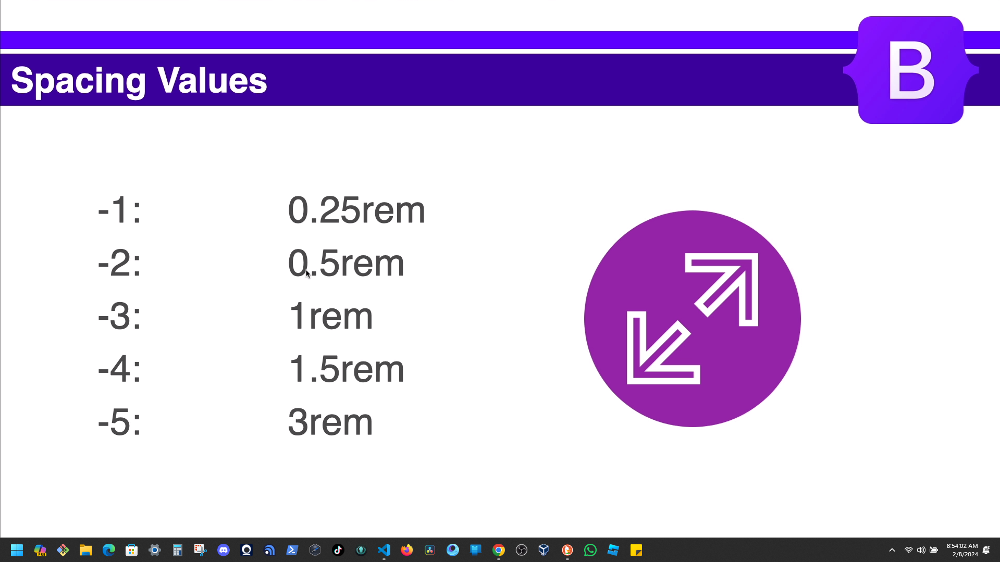

# Section 2: Bootstrap Fundamentals - Part 1
## Containers

```HTML
<!DOCTYPE html>
<html lang="en">
  <head>
    <meta charset="UTF-8" />
    <meta http-equiv="X-UA-Compatible" content="IE=edge" />
    <meta name="viewport" content="width=device-width, initial-scale=1.0" />
    <link rel="stylesheet" href="./assets/css/bootstrap.min.css" />

    <title>Bootstrap Sandbox | Containers</title>
  </head>
  <body>
    <h1 class="mb-5">Containers</h1>

    <div class="container"><!-- Add container class -->
      <h3>Container</h3>
      <p>
        Lorem ipsum dolor sit amet, consectetur adipisicing elit. Aliquid
        similique porro praesentium quo. Aperiam officiis eos atque iure quo
        nostrum voluptate laudantium distinctio! Hic pariatur in exercitationem
        eaque ducimus aperiam.
      </p>
    </div>

    <div class="container-sm"><!-- container small -->
      <h3>Container Small</h3>
      <p>
        Lorem ipsum dolor sit amet, consectetur adipisicing elit. Aliquid
        similique porro praesentium quo. Aperiam officiis eos atque iure quo
        nostrum voluptate laudantium distinctio! Hic pariatur in exercitationem
        eaque ducimus aperiam.
      </p>
    </div>

    <div class="container-md"><!-- container medium-->
      <h3>Container Medium</h3>
      <p>
        Lorem ipsum dolor sit amet, consectetur adipisicing elit. Aliquid
        similique porro praesentium quo. Aperiam officiis eos atque iure quo
        nostrum voluptate laudantium distinctio! Hic pariatur in exercitationem
        eaque ducimus aperiam.
      </p>
    </div>

    <div class="container-lg"><!-- container large-->
      <h3>Container Large</h3>
      <p>
        Lorem ipsum dolor sit amet, consectetur adipisicing elit. Aliquid
        similique porro praesentium quo. Aperiam officiis eos atque iure quo
        nostrum voluptate laudantium distinctio! Hic pariatur in exercitationem
        eaque ducimus aperiam.
      </p>
    </div>

    <div class="container-xl"><!-- container extra large -->
      <h3>Container Extra Large</h3>
      <p>
        Lorem ipsum dolor sit amet, consectetur adipisicing elit. Aliquid
        similique porro praesentium quo. Aperiam officiis eos atque iure quo
        nostrum voluptate laudantium distinctio! Hic pariatur in exercitationem
        eaque ducimus aperiam.
      </p>
    </div>

    <div class="container-xxl"><!-- container extra extra large -->
      <h3>Container Extra Extra Large</h3>
      <p>
        Lorem ipsum dolor sit amet, consectetur adipisicing elit. Aliquid
        similique porro praesentium quo. Aperiam officiis eos atque iure quo
        nostrum voluptate laudantium distinctio! Hic pariatur in exercitationem
        eaque ducimus aperiam.
      </p>
    </div>

    <div class="container-fluid"><!-- container fluid -->
      <h3>Container Fluid</h3>
      <p>
        Lorem ipsum dolor sit amet, consectetur adipisicing elit. Aliquid
        similique porro praesentium quo. Aperiam officiis eos atque iure quo
        nostrum voluptate laudantium distinctio! Hic pariatur in exercitationem
        eaque ducimus aperiam.
      </p>
    </div>

    <script src="./assets/js/bootstrap.bundle.min.js"></script>
  </body>
</html> 
```
## Typography.
```HTML
<!DOCTYPE html>
<html lang="en">
  <head>
    <meta charset="UTF-8" />
    <meta http-equiv="X-UA-Compatible" content="IE=edge" />
    <meta name="viewport" content="width=device-width, initial-scale=1.0" />
    <link rel="stylesheet" href="./assets/css/bootstrap.min.css" />
    <title>Bootstrap Sandbox | Typography</title>
  </head>
  <body>
    <div class="container">
      <h1 class="mb-5">Typography</h1>

      <!-- Headings -->
      <h1>Heading 1</h1>
      <h2>Heading 2</h2>
      <h3>Heading 3</h3>
      <h4>Heading 4</h4>
      <h5>Heading 5</h5>
      <h6>Heading 6</h6>

      <br /><br />

      <!-- Heading Classes -->
      <p class="h1">Heading 1 Paragraph</p><!-- Heading 1 -->
      <p class="h2">Heading 2 Paragraph</p><!-- Heading 2 -->
      <p class="h3">Heading 3 Paragraph</p><!-- Heading 3 -->
      <p class="h4">Heading 4 Paragraph</p><!-- Heading 4 -->
      <p class="h5">Heading 5 Paragraph</p><!-- Heading 5 -->
      <p class="h6">Heading 6 Paragraph</p><!-- Heading 6 -->

      <br /><br />

      <!-- Display Headings -->
      <h1 class="display-1">Display 1</h1><!-- class="display-1" -->
      <h1 class="display-2">Display 2</h1><!-- class="display-2" -->
      <h1 class="display-3">Display 3</h1><!-- class="display-3" -->
      <h1 class="display-4">Display 4</h1><!-- class="display-4" -->
      <h1 class="display-5">Display 5</h1><!-- class="display-5" -->
      <h1 class="display-6">Display 6</h1><!-- class="display-6" -->

      <br /><br />

      <!-- Inline Classes -->
      <p class="lead"><!-- class="lead" -->
        Lorem, ipsum dolor sit
        <span class="">This is highlighted text</span>amet consectetur
        adipisicing <span class="">This is strong text</span>Lorem ipsum dolor
        sit. <span class="">This is strikethrough text</span> Lorem ipsum dolor
        sit amet. <span class="">This is underlined tect</span> Lorem ipsum
        dolor sit amet. <span class="">This is italic text</span>
      </p>

      <br /><br />

      <!-- Blockquote -->
      <blockquote class="blockquote"><!-- class="blockquote"-->
        <p>This is a blockquote</p>
      </blockquote>

      <br /><br />

      <!-- Font Weight -->
      <p class="fw-bold">This is bold text</p><!-- fw-bold -->
      <p class="fw-bolder">This is bolder text (relative to the parent element).</p><!-- fw-bolder-->
      <p class="fw-semibold">This is semibold text</p><!-- fw-semibold -->
      <p class="fw-medium">This is a medium weight</p><!-- fw-medium -->
      <p class="fw-normal">This is a normal weight</p><!-- fw-normal -->
      <p class="fw-light">This is light weight text</p><!-- fw-light -->
      <p class="fw-lighter"> <!-- fw-lighter -->
        This is lighter weight text (relative to the parent element).
      </p>
      <p class="fst-italic">This is italic text.</p><!-- fst-italic -->
      <p class="fst-normal">This is text with normal font style</p><!-- fst-normal -->

      <br /><br />

      <!-- Line Height -->
      <p class="lh-1"><!-- lh-1 -->
        Lorem ipsum dolor sit amet consectetur adipisicing elit. Itaque dolor
        sit obcaecati architecto necessitatibus velit? Excepturi culpa ipsa enim
        eveniet, alias assumenda quas omnis laborum atque ipsam ipsum minima a.
      </p>
      <p class="lh-sm"><!-- lh-sm -->
        Lorem ipsum dolor sit amet consectetur adipisicing elit. Itaque dolor
        sit obcaecati architecto necessitatibus velit? Excepturi culpa ipsa enim
        eveniet, alias assumenda quas omnis laborum atque ipsam ipsum minima a.
      </p>
      <p class="lh-base"><!-- lh-base -->
        Lorem ipsum dolor sit amet consectetur adipisicing elit. Itaque dolor
        sit obcaecati architecto necessitatibus velit? Excepturi culpa ipsa enim
        eveniet, alias assumenda quas omnis laborum atque ipsam ipsum minima a.
      </p>
      <p class="lh-lg"><!-- lh-lg -->
        Lorem ipsum dolor sit amet consectetur adipisicing elit. Itaque dolor
        sit obcaecati architecto necessitatibus velit? Excepturi culpa ipsa enim
        eveniet, alias assumenda quas omnis laborum atque ipsam ipsum minima a.
      </p>

      <br /><br />

      <!-- Text Transform -->
      <p class="text-lowercase">lowercased text</p><!-- text-lowercase -->
      <p class="text-uppercase">uppercased text</p><!-- text-uppercase -->
      <p class="text-capitalized">capitialized text</p><!-- text-capitalized -->

      <br /><br />

      <!-- Text Alignment -->
      <p class="text-start">Start aligned text on all viewport sizes.</p><!-- text-start -->
      <p class="text-center">Center aligned text on all viewport sizes.</p><!-- text-center -->
      <p class="text-end">End aligned text on all viewport sizes.</p><!-- text-end -->

      <p class="text-sm-end">Start aligned text on viewports sized SM (small) or wider.</p><!-- text-sm-end -->
      <p class="text-md-end">
        Start aligned text on viewports sized MD (medium) or wider.
      </p><!-- text-md-end -->
      <p class="text-lg-end">Start aligned text on viewports sized LG (large) or wider.</p><!-- text-lg-end -->
      <p class="text-xl-end">
        Start aligned text on viewports sized XL (extra-large) or wider.
      </p><!-- text-xl-end -->

      <!-- Don't go past here -->
    </div>
    <div style="margin-top: 350px"></div>

    <script src="./assets/js/bootstrap.bundle.min.js"></script>
  </body>
</html>
```
## Display & Position.
```HTML
<!DOCTYPE html>
<html lang="en">
  <head>
    <meta charset="UTF-8" />
    <meta http-equiv="X-UA-Compatible" content="IE=edge" />
    <meta name="viewport" content="width=device-width, initial-scale=1.0" />
    <link rel="stylesheet" href="./assets/css/bootstrap.min.css" />
    <title>Bootstrap Sandbox | Display & Position</title>
  </head>
  <body>
    <div class="container">
      <h1 class="mb-5">Display & Position</h1>

      <!-- Display None -->
      <p class="d-none">This text is hidden</p><!-- d-none -->

      <br /><br />

      <!-- Display Inline -->
      <div class="d-inline">This text is inline</div><!-- d-inline -->
      <div class="d-inline">This text is inline</div><!-- d-inline -->

      <br /><br />

      <!-- Display Block -->
      <span class="d-block">This span is block</span><!-- d-block -->
      <span class="d-block">This span is block</span><!-- d-block -->

      <br /><br />

      <!-- Display Inline Block -->
      <span class="d-inline-block" style="width: 500px">This span is inline-block</span><!-- d-inline-block -->
      <span class="d-inline-block">This span is inline-block</span><!-- d-inline-block -->

      <br /><br />

      <!-- Hide on small screens -->
      <div class="d-none d-md-block">This div is hidden on mobile</div><!-- d-none d-md-block -->

      <br /><br />

      <!-- Hide on medium screens and up -->
      <div class="d-block d-md-none">This div is hidden on medium screens and up</div> <!-- d-block d-md-none -->

      <br /><br />

      <!-- POSITIONING -->

      <!-- Position Static -->
      <p class="position-static">This text is static</p><!-- position-static -->

      <br /><br />
      
      <div class="position-relative" style="height: 200px; width: 200px; background: #ccc">

        <p class="position-absolute start-0 bottom-0" style="top:40px"></p><!-- position-absolute start-0 bottom-0  style="top:40px"-->
      
      </div><!-- position-relative -->

      <br /><br />

      <!-- Position Fixed -->
      <p class="position-fixed">This text is fixed</p><!-- position-fixed -->

      <br /><br />

      <p class="fixed-top">This text is fixed top</p><!-- fixed-top -->
      <p class="fixed-bottom">This text is fixed bottom</p><!-- fixed-bottom -->

      <br /><br />

      <!-- Sticky Top -->
      <p class="">This text is sticky top</p><!--  -->

      <br /><br />

      <!-- Filler Text -->
      <p>
        Lorem ipsum dolor sit amet consectetur adipisicing elit. Itaque
        perferendis voluptatibus eveniet nesciunt explicabo architecto
        voluptatem! Laudantium mollitia voluptate sit dolor! Maiores architecto
        iure placeat, deleniti iste doloribus velit quam magnam ex blanditiis
        itaque ipsum consectetur dolorem debitis optio temporibus facere error
        eaque nesciunt accusantium possimus. Dolorum assumenda molestias
        cupiditate exercitationem esse, nam inventore nesciunt eaque, ex
        reiciendis distinctio sequi optio sint at a nulla. Iure rem architecto
        voluptatem aliquam molestiae odit exercitationem vitae, debitis neque
        nostrum aperiam fugiat tempore magnam cum! Harum excepturi iusto iste
        porro ex cum optio magnam labore doloremque culpa possimus asperiores
        aliquid incidunt, hic, necessitatibus neque obcaecati aliquam. Aperiam,
        excepturi facere dolores temporibus corporis dicta atque iusto
        repudiandae debitis voluptas quasi magni quisquam sit veniam
        necessitatibus veritatis fugit dolorum rerum animi? Beatae facere ipsam
        distinctio. Minima unde tempore maiores aliquid sunt nihil dolorum,
        itaque alias, possimus sequi nobis! Commodi maxime, quos reprehenderit
        mollitia veritatis ipsa nobis quo numquam quis rem expedita temporibus
        laudantium nulla, exercitationem magnam, voluptates et? Voluptates,
        cumque laboriosam soluta saepe explicabo quisquam ex a voluptatum
        assumenda quia vel iusto reiciendis eaque provident! Eveniet numquam
        aut, rerum et perferendis praesentium, maiores eaque nihil earum
        voluptate dolores dolore blanditiis pariatur aliquid aspernatur
        consectetur! Minus, voluptatum autem veniam ducimus id earum similique
        alias cum impedit blanditiis, suscipit, tempora iusto nemo ea. Eum
        ducimus architecto dolorum fugit saepe nesciunt, fuga aspernatur ratione
        debitis quos sequi, nisi eius inventore enim magni id et perspiciatis
        reprehenderit, animi adipisci voluptates porro. Enim, error non! Aliquam
        sapiente maxime praesentium ullam possimus recusandae illum qui non amet
        dolorum earum error, provident, voluptas quas eveniet minus voluptatibus
        excepturi eaque laboriosam. Maxime, fugiat. Sed ipsum aliquam suscipit
        officiis excepturi omnis, optio possimus placeat laudantium quam facilis
        dolore voluptate aperiam expedita pariatur ipsa recusandae perferendis
        perspiciatis nesciunt quos earum praesentium dolores! Error expedita
        nulla inventore atque voluptates excepturi ea fuga optio blanditiis
        totam nesciunt saepe, voluptate minima voluptatem accusamus vero
        aliquid! Necessitatibus ut corporis illo praesentium, assumenda,
        perspiciatis quo magni similique, animi cupiditate iure. Corrupti
        reiciendis harum nobis, aperiam itaque dolores accusantium voluptates
        quos mollitia amet dignissimos inventore tempora laudantium, fuga
        repudiandae voluptate odit tenetur? Doloremque soluta rem a
        consequuntur, consectetur obcaecati. Quia hic architecto officiis
        sapiente dolore odit, illum corporis laboriosam. Quas quidem doloribus
        quaerat rerum est, ad repudiandae provident culpa reiciendis illum
        soluta nesciunt non iusto beatae earum accusamus maiores recusandae
        ducimus sint, minus consectetur? Natus beatae officiis molestiae
        explicabo excepturi, sapiente vitae provident aut consequatur ea atque
        velit laborum. Nulla amet sequi quisquam fugiat repellendus libero
        dolor. Quisquam voluptates quos sapiente est doloribus fugit, quam
        necessitatibus commodi? Ex, consectetur. Incidunt, explicabo quaerat
        iusto aliquid corporis cumque iure perferendis ipsam at velit vero nulla
        quisquam ab dicta odio illo! Numquam cupiditate consequatur ut,
        voluptatum quas excepturi quis nulla error maiores cum illo nesciunt
        voluptatem accusantium itaque iusto dolor modi! Mollitia eos culpa
        nostrum ducimus rem quasi animi tenetur reprehenderit velit nesciunt
        placeat, reiciendis eligendi saepe officiis nihil rerum odio ratione
        illo voluptatibus ipsa consequuntur dicta voluptatum impedit? Aperiam
        veritatis fugit totam. Labore.
      </p><!--  -->
      <!-- Don't go past here -->
    </div>
    <div style="margin-top: 350px"></div>

    <script src="./assets/js/bootstrap.bundle.min.js"></script>
  </body>
</html>
```
## Background & Text Colors.
```HTML
<!DOCTYPE html>
<html lang="en">
  <head>
    <meta charset="UTF-8" />
    <meta http-equiv="X-UA-Compatible" content="IE=edge" />
    <meta name="viewport" content="width=device-width, initial-scale=1.0" />
    <link rel="stylesheet" href="./assets/css/bootstrap.min.css" />
    <title>Bootstrap Sandbox | Background & Text Colors</title>
  </head>
  <body>
    <div class="container">
      <h1 class="mb-5">Background & Text Colors</h1>

      <!-- Background Colors -->
      <div class="bg-primary">.bg-primary</div><!-- bg-primary -->
      <div class="bg-secondary">.bg-secondary</div><!-- bg-secondary -->
      <div class="bg-success">.bg-success</div><!-- bg-success -->
      <div class="bg-danger">.bg-danger</div><!-- bg-danger -->
      <div class="bg-warning">.bg-warning</div><!-- bg-warning -->
      <div class="bg-info">.bg-info</div><!-- bg-info -->
      <div class="bg-light">.bg-light</div><!-- bg-light -->
      <div class="bg-dark">.bg-dark</div><!-- bg-dark -->
      <div class="bg-black">.bg-black</div><!-- bg-black -->
      <div class="bg-white">.bg-white</div><!-- bg-white -->
      <div class="bg-transparent">.bg-transparent</div><!-- bg-transparent -->

      <br /><br />

      <!-- Text Background Colors -->
      <div class="text-bg-primary">.bg-primary</div><!-- text-bg-primary -->
      <div class="text-bg-secondary">.bg-secondary</div><!-- text-bg-secondary -->
      <div class="text-bg-success">.bg-success</div><!-- text-bg-success -->
      <div class="text-bg-danger">.bg-danger</div><!-- text-bg-danger -->
      <div class="text-bg-warning">.bg-warning</div><!-- text-bg-warning -->
      <div class="text-bg-info">.bg-info</div><!-- text-bg-info -->
      <div class="text-bg-light">.bg-light</div><!-- text-bg-light -->
      <div class="text-bg-dark">.bg-dark</div><!-- text-bg-dark -->
      <div class="text-bg-black">.bg-black</div><!-- text-bg-black -->
      <div class="text-bg-white">.bg-white</div><!-- text-bg-white -->
      <div class="text-bg-transparent">.bg-transparent</div><!-- text-bg-transparent -->

      <br /><br />

      <!-- Text Colors -->
      <div class="text-primary">.bg-primary</div><!-- text-primary -->
      <div class="text-secondary">.bg-secondary</div><!-- text-secondary -->
      <div class="text-success">.bg-success</div><!-- text-success -->
      <div class="text-danger">.bg-danger</div><!-- text-danger -->
      <div class="text-warning">.bg-warning</div><!-- text-warning -->
      <div class="text-info">.bg-info</div><!-- text-info -->
      <div class="text-light">.bg-light</div><!-- text-light -->
      <div class="text-dark">.bg-dark</div><!-- text-dark -->
      <div class="text-black">.bg-black</div><!-- text-black -->
      <div class="text-white">.bg-white</div><!-- text-white -->
      <div class="text-transparent">.bg-transparent</div><!-- text-transparent -->

      <br /><br />

      <!-- Gradients -->
      <div class="text-bg-primary bg-gradient">.bg-primary</div><!-- text-bg-primary bg-gradient -->
      <div class="text-bg-secondary bg-gradient">.bg-secondary</div><!-- text-bg-secondary bg-gradient -->
      <div class="text-bg-success bg-gradient">.bg-success</div><!-- text-bg-success bg-gradient -->
      <div class="text-bg-danger bg-gradient">.bg-danger</div><!-- text-bg-danger bg-gradient -->
      <div class="text-bg-warning bg-gradient">.bg-warning</div><!-- text-bg-warning bg-gradient -->
      <div class="text-bg-info bg-gradient">.bg-info</div><!-- text-bg-info bg-gradient -->
      <div class="text-bg-light bg-gradient">.bg-light</div><!-- text-bg-light bg-gradient -->
      <div class="text-bg-dark bg-gradient">.bg-dark</div><!-- text-bg-dark bg-gradient -->
      <div class="text-bg-black bg-gradient">.bg-black</div><!-- text-bg-black bg-gradient -->
      <div class="text-bg-white bg-gradient">.bg-white</div><!-- text-bg-white bg-gradient -->
      <div class="text-bg-transparent bg-gradient">.bg-transparent</div><!-- text-bg-transparent bg-gradient -->


      <br /><br />

      <!-- Background Opacity -->
      <div class="text-bg-success">Default success background</div><!-- text-bg-success bg-opacity-75 -->
      <div class="text-bg-success bg-opacity-75">75% opacity success background</div><!-- text-bg-success bg-opacity-75 -->
      <div class="text-bg-success bg-opacity-50">50% opacity success background</div><!-- text-bg-success bg-opacity-50 -->
      <div class="text-bg-success bg-opacity-25">25% opacity success background</div><!-- text-bg-success bg-opacity-10 -->
      <div class="text-bg-success bg-opacity-10">10% opacity success background</div><!-- text-bg-success bg-opacity-10 -->

      <br /><br />

      <!-- Text Opacity -->
      <div class="text-primary">Default primary text</div><!--  -->
      <div class="text-primary text-opacity-75">75% opacity primary text</div><!--  text-primary text-opacity-75 -->
      <div class="text-primary text-opacity-50">50% opacity primary text</div><!--  text-primary text-opacity-50 -->
      <div class="text-primary text-opacity-25">25% opacity primary text</div><!--  text-primary text-opacity-25 -->

      <!-- Link Colors -->
      <p><a href="#" class="link-primary">Primary link</a></p><!-- link-primary -->
      <p><a href="#" class="link-secondary">Secondary link</a></p><!-- link-secondary -->
      <p><a href="#" class="link-success">Success link</a></p><!-- link-success -->
      <p><a href="#" class="link-danger">Danger link</a></p><!-- link-danger -->
      <p><a href="#" class="link-warning">Warning link</a></p><!-- link-warning -->
      <p><a href="#" class="link-info">Info link</a></p><!-- link-info -->

      <!-- Don't go past here -->
    </div>
    <div style="margin-top: 350px"></div>

    <script src="./assets/js/bootstrap.bundle.min.js"></script>
  </body>
</html>
```
## Spacing

```HTML
<!DOCTYPE html>
<html lang="en">
  <head>
    <meta charset="UTF-8" />
    <meta http-equiv="X-UA-Compatible" content="IE=edge" />
    <meta name="viewport" content="width=device-width, initial-scale=1.0" />
    <link rel="stylesheet" href="./assets/css/bootstrap.min.css" />
    <title>Bootstrap Sandbox | Spacing</title>
  </head>
  <body>
    <div class="container">
      <h1 class="mb-5">Spacing</h1>
      <!-- Margin All -->
      <div class="text-bg-dark m-1">Lorem, ipsum dolor.</div><!-- text-bg-dark m-1 -->
      <div class="text-bg-dark m-2">Lorem, ipsum dolor.</div><!-- text-bg-dark m-2 -->
      <div class="text-bg-dark m-3">Lorem, ipsum dolor.</div><!-- text-bg-dark m-3 -->
      <div class="text-bg-dark m-4">Lorem, ipsum dolor.</div><!-- text-bg-dark m-4 -->
      <div class="text-bg-dark m-5">Lorem, ipsum dolor.</div><!-- text-bg-dark m-5 -->

      <!-- Margin Top & Bottom -->
      <div class="text-bg-success my-1 ">Lorem, ipsum dolor.</div><!-- text-bg-success  my-1 -->
      <div class="text-bg-success my-2 ">Lorem, ipsum dolor.</div><!-- text-bg-success  my-2 -->
      <div class="text-bg-success my-3 ">Lorem, ipsum dolor.</div><!-- text-bg-success  my-3 -->
      <div class="text-bg-success my-4 ">Lorem, ipsum dolor.</div><!-- text-bg-success  my-4 -->
      <div class="text-bg-success my-5 ">Lorem, ipsum dolor.</div><!-- text-bg-success  my-5 -->

      <!-- Margin Left & Right -->
      <div class="text-bg-secondary mx-1">Lorem, ipsum dolor.</div><!-- text-bg-secondary mx-1 -->
      <div class="text-bg-secondary mx-2">Lorem, ipsum dolor.</div><!-- text-bg-secondary mx-2 -->
      <div class="text-bg-secondary mx-3">Lorem, ipsum dolor.</div><!-- text-bg-secondary mx-3 -->
      <div class="text-bg-secondary mx-4">Lorem, ipsum dolor.</div><!-- text-bg-secondary mx-4 -->
      <div class="text-bg-secondary mx-5">Lorem, ipsum dolor.</div><!-- text-bg-secondary mx-5 -->

      <!-- Margin Top -->
      <div class="text-bg-danger mt-1">Lorem, ipsum dolor.</div><!-- text-bg-danger mt-1 -->
      <div class="text-bg-danger mt-2">Lorem, ipsum dolor.</div><!-- text-bg-danger mt-2 -->
      <div class="text-bg-danger mt-3">Lorem, ipsum dolor.</div><!-- text-bg-danger mt-3 -->
      <div class="text-bg-danger mt-4">Lorem, ipsum dolor.</div><!-- text-bg-danger mt-4 -->
      <div class="text-bg-danger mt-5">Lorem, ipsum dolor.</div><!-- text-bg-danger mt-5 -->

      <!-- Margin Bottom -->
      <div class="text-bg-warning mb-1">Lorem, ipsum dolor.</div><!-- text-bg-warning mb-1 -->
      <div class="text-bg-warning mb-2">Lorem, ipsum dolor.</div><!-- text-bg-warning mb-2 -->
      <div class="text-bg-warning mb-3">Lorem, ipsum dolor.</div><!-- text-bg-warning mb-3 -->
      <div class="text-bg-warning mb-4">Lorem, ipsum dolor.</div><!-- text-bg-warning mb-4 -->
      <div class="text-bg-warning mb-5">Lorem, ipsum dolor.</div><!-- text-bg-warning mb-5 -->

      <!-- Margin Left/Start -->
      <div class="text-bg-info ms-1">Lorem, ipsum dolor.</div><!-- text-bg-info ms-1 -->
      <div class="text-bg-info ms-2">Lorem, ipsum dolor.</div><!-- text-bg-info ms-2 -->
      <div class="text-bg-info ms-3">Lorem, ipsum dolor.</div><!-- text-bg-info ms-3 -->
      <div class="text-bg-info ms-4">Lorem, ipsum dolor.</div><!-- text-bg-info ms-4 -->
      <div class="text-bg-info ms-5">Lorem, ipsum dolor.</div><!-- text-bg-info ms-5 -->

      <!-- Margin Right/End -->
      <div class="text-bg-dark me-1">Lorem, ipsum dolor.</div><!--  text-bg-dark me-1 -->
      <div class="text-bg-dark me-2">Lorem, ipsum dolor.</div><!--  text-bg-dark me-2 -->
      <div class="text-bg-dark me-3">Lorem, ipsum dolor.</div><!--  text-bg-dark me-3 -->
      <div class="text-bg-dark me-4">Lorem, ipsum dolor.</div><!--  text-bg-dark me-4 -->
      <div class="text-bg-dark me-5">Lorem, ipsum dolor.</div><!--  text-bg-dark me-5 -->

      <!-- Margin Auto -->
      <div class="text-bg-warning w-50 m-auto">Lorem, ipsum dolor.</div><!-- text-bg-warning w-50 m-auto -->
      <div class="text-bg-warning w-50 my-auto">Lorem, ipsum dolor.</div><!-- text-bg-warning w-50 my-auto -->
      <div class="text-bg-warning w-50 mx-auto">Lorem, ipsum dolor.</div><!-- text-bg-warning w-50 mx-auto -->
      <div class="text-bg-warning w-50 ms-auto">Lorem, ipsum dolor.</div><!-- text-bg-warning w-50 ms-auto -->
      <div class="text-bg-warning w-50 me-auto">Lorem, ipsum dolor.</div><!-- text-bg-warning w-50 me-auto -->

      <!-- Padding All -->
      <div class="text-bg-dark my-1 p-1">Lorem, ipsum dolor.</div><!-- text-bg-dark my-1 p-1 -->
      <div class="text-bg-dark my-2 p-1">Lorem, ipsum dolor.</div><!-- text-bg-dark my-2 p-1 -->
      <div class="text-bg-dark my-3 p-1">Lorem, ipsum dolor.</div><!-- text-bg-dark my-3 p-1 -->
      <div class="text-bg-dark my-4 p-1">Lorem, ipsum dolor.</div><!-- text-bg-dark my-4 p-1 -->
      <div class="text-bg-dark my-5 p-1">Lorem, ipsum dolor.</div><!-- text-bg-dark my-5 p-1 -->

      <!-- Padding Top & Bottom -->
      <div class="text-bg-success py-2">Lorem, ipsum dolor.</div><!--  -->
      <div class="text-bg-success py-2">Lorem, ipsum dolor.</div><!--  -->
      <div class="text-bg-success py-2">Lorem, ipsum dolor.</div><!--  -->
      <div class="text-bg-success py-2">Lorem, ipsum dolor.</div><!--  -->
      <div class="text-bg-success py-2">Lorem, ipsum dolor.</div><!--  -->

      <!-- Padding Left & Right -->
      <div class="text-bg-danger my-2">Lorem, ipsum dolor.</div><!--  -->
      <div class="text-bg-danger my-2">Lorem, ipsum dolor.</div><!--  -->
      <div class="text-bg-danger my-2">Lorem, ipsum dolor.</div><!--  -->
      <div class="text-bg-danger my-2">Lorem, ipsum dolor.</div><!--  -->
      <div class="text-bg-danger my-2">Lorem, ipsum dolor.</div><!--  -->

      <!-- Padding Top -->
      <div class="text-bg-info my-2">Lorem, ipsum dolor.</div><!--  -->
      <div class="text-bg-info my-2">Lorem, ipsum dolor.</div><!--  -->
      <div class="text-bg-info my-2">Lorem, ipsum dolor.</div><!--  -->
      <div class="text-bg-info my-2">Lorem, ipsum dolor.</div><!--  -->
      <div class="text-bg-info my-2">Lorem, ipsum dolor.</div><!--  -->

      <!-- Padding Bottom -->
      <div class="text-bg-warning my-2">Lorem, ipsum dolor.</div><!--  -->
      <div class="text-bg-warning my-2">Lorem, ipsum dolor.</div><!--  -->
      <div class="text-bg-warning my-2">Lorem, ipsum dolor.</div><!--  -->
      <div class="text-bg-warning my-2">Lorem, ipsum dolor.</div><!--  -->
      <div class="text-bg-warning my-2">Lorem, ipsum dolor.</div><!--  -->

      <!-- Padding Left/Start -->
      <div class="text-bg-primary my-2">Lorem, ipsum dolor.</div><!--  -->
      <div class="text-bg-primary my-2">Lorem, ipsum dolor.</div><!--  -->
      <div class="text-bg-primary my-2">Lorem, ipsum dolor.</div><!--  -->
      <div class="text-bg-primary my-2">Lorem, ipsum dolor.</div><!--  -->
      <div class="text-bg-primary my-2">Lorem, ipsum dolor.</div><!--  -->

      <!-- Padding Right/End -->
      <div class="text-bg-primary my-2">Lorem, ipsum dolor.</div><!--  -->
      <div class="text-bg-primary my-2">Lorem, ipsum dolor.</div><!--  -->
      <div class="text-bg-primary my-2">Lorem, ipsum dolor.</div><!--  -->
      <div class="text-bg-primary my-2">Lorem, ipsum dolor.</div><!--  -->
      <div class="text-bg-primary my-2">Lorem, ipsum dolor.</div><!--  -->

      <!-- Stacks -->
      <div class="">
        <div class="p-2 bg-info">First item</div><!--  -->
        <div class="p-2 bg-info">Second item</div><!--  -->
        <div class="p-2 bg-info">Third item</div><!--  -->
      </div>

      <div class="">
        <div class="p-2 text-bg-success">First item</div><!--  -->
        <div class="p-2 text-bg-success">Second item</div><!--  -->
        <div class="p-2 text-bg-success">Third item</div><!--  -->
      </div>

      <!-- Don't go past here -->
    </div>
    <div style="margin-top: 350px"></div>

    <script src="./assets/js/bootstrap.bundle.min.js"></script>
  </body>
</html>
```
# Template
<table>
    <thead>
    </thead>
    <tbody>
      <tr>
        <td></br> 
        </td>
        <td>
          <ul>
            <li></li>
            <li></li>
            <li></li>
            <li></li>
          </ul>
      </td>
      </tr>
    </tbody>
</table> 

```HTML

```
<table>
    <thead>
    </thead>
    <tbody>
      <tr>
        <td>Pomodoro</br> 
        </td>
        <td>
          <ul>
            <li></li>
            <li></li>
            <li></li>
            <li></li>
          </ul>
      </td>
      </tr>
    </tbody>
</table> 

