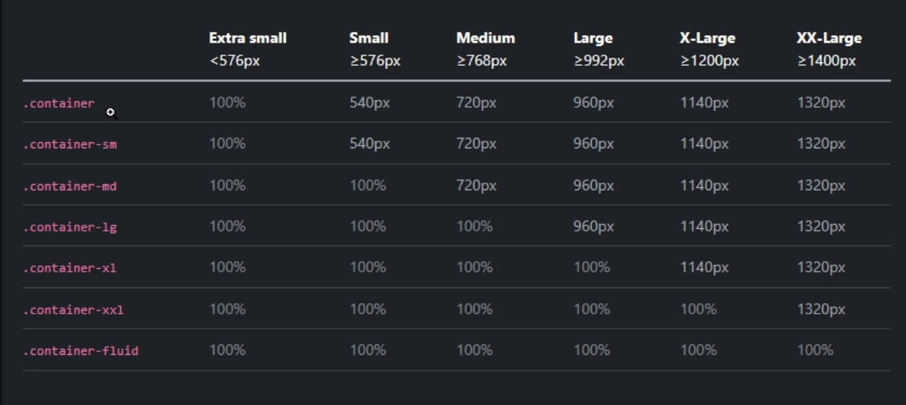

# Section 2: Bootstrap Fundamentals - Part 1
## Containers

```HTML
<!DOCTYPE html>
<html lang="en">
  <head>
    <meta charset="UTF-8" />
    <meta http-equiv="X-UA-Compatible" content="IE=edge" />
    <meta name="viewport" content="width=device-width, initial-scale=1.0" />
    <link rel="stylesheet" href="./assets/css/bootstrap.min.css" />

    <title>Bootstrap Sandbox | Containers</title>
  </head>
  <body>
    <h1 class="mb-5">Containers</h1>

    <div class="container"><!-- Add container class -->
      <h3>Container</h3>
      <p>
        Lorem ipsum dolor sit amet, consectetur adipisicing elit. Aliquid
        similique porro praesentium quo. Aperiam officiis eos atque iure quo
        nostrum voluptate laudantium distinctio! Hic pariatur in exercitationem
        eaque ducimus aperiam.
      </p>
    </div>

    <div class="container-sm"><!-- container small -->
      <h3>Container Small</h3>
      <p>
        Lorem ipsum dolor sit amet, consectetur adipisicing elit. Aliquid
        similique porro praesentium quo. Aperiam officiis eos atque iure quo
        nostrum voluptate laudantium distinctio! Hic pariatur in exercitationem
        eaque ducimus aperiam.
      </p>
    </div>

    <div class="container-md"><!-- container medium-->
      <h3>Container Medium</h3>
      <p>
        Lorem ipsum dolor sit amet, consectetur adipisicing elit. Aliquid
        similique porro praesentium quo. Aperiam officiis eos atque iure quo
        nostrum voluptate laudantium distinctio! Hic pariatur in exercitationem
        eaque ducimus aperiam.
      </p>
    </div>

    <div class="container-lg"><!-- container large-->
      <h3>Container Large</h3>
      <p>
        Lorem ipsum dolor sit amet, consectetur adipisicing elit. Aliquid
        similique porro praesentium quo. Aperiam officiis eos atque iure quo
        nostrum voluptate laudantium distinctio! Hic pariatur in exercitationem
        eaque ducimus aperiam.
      </p>
    </div>

    <div class="container-xl"><!-- container extra large -->
      <h3>Container Extra Large</h3>
      <p>
        Lorem ipsum dolor sit amet, consectetur adipisicing elit. Aliquid
        similique porro praesentium quo. Aperiam officiis eos atque iure quo
        nostrum voluptate laudantium distinctio! Hic pariatur in exercitationem
        eaque ducimus aperiam.
      </p>
    </div>

    <div class="container-xxl"><!-- container extra extra large -->
      <h3>Container Extra Extra Large</h3>
      <p>
        Lorem ipsum dolor sit amet, consectetur adipisicing elit. Aliquid
        similique porro praesentium quo. Aperiam officiis eos atque iure quo
        nostrum voluptate laudantium distinctio! Hic pariatur in exercitationem
        eaque ducimus aperiam.
      </p>
    </div>

    <div class="container-fluid"><!-- container fluid -->
      <h3>Container Fluid</h3>
      <p>
        Lorem ipsum dolor sit amet, consectetur adipisicing elit. Aliquid
        similique porro praesentium quo. Aperiam officiis eos atque iure quo
        nostrum voluptate laudantium distinctio! Hic pariatur in exercitationem
        eaque ducimus aperiam.
      </p>
    </div>

    <script src="./assets/js/bootstrap.bundle.min.js"></script>
  </body>
</html> 
```
## Typography.
```HTML
<!DOCTYPE html>
<html lang="en">
  <head>
    <meta charset="UTF-8" />
    <meta http-equiv="X-UA-Compatible" content="IE=edge" />
    <meta name="viewport" content="width=device-width, initial-scale=1.0" />
    <link rel="stylesheet" href="./assets/css/bootstrap.min.css" />
    <title>Bootstrap Sandbox | Typography</title>
  </head>
  <body>
    <div class="container">
      <h1 class="mb-5">Typography</h1>

      <!-- Headings -->
      <h1>Heading 1</h1>
      <h2>Heading 2</h2>
      <h3>Heading 3</h3>
      <h4>Heading 4</h4>
      <h5>Heading 5</h5>
      <h6>Heading 6</h6>

      <br /><br />

      <!-- Heading Classes -->
      <p class="h1">Heading 1 Paragraph</p><!-- Heading 1 -->
      <p class="h2">Heading 2 Paragraph</p><!-- Heading 2 -->
      <p class="h3">Heading 3 Paragraph</p><!-- Heading 3 -->
      <p class="h4">Heading 4 Paragraph</p><!-- Heading 4 -->
      <p class="h5">Heading 5 Paragraph</p><!-- Heading 5 -->
      <p class="h6">Heading 6 Paragraph</p><!-- Heading 6 -->

      <br /><br />

      <!-- Display Headings -->
      <h1 class="display-1">Display 1</h1><!-- class="display-1" -->
      <h1 class="display-2">Display 2</h1><!-- class="display-2" -->
      <h1 class="display-3">Display 3</h1><!-- class="display-3" -->
      <h1 class="display-4">Display 4</h1><!-- class="display-4" -->
      <h1 class="display-5">Display 5</h1><!-- class="display-5" -->
      <h1 class="display-6">Display 6</h1><!-- class="display-6" -->

      <br /><br />

      <!-- Inline Classes -->
      <p class="lead"><!-- class="lead" -->
        Lorem, ipsum dolor sit
        <span class="">This is highlighted text</span>amet consectetur
        adipisicing <span class="">This is strong text</span>Lorem ipsum dolor
        sit. <span class="">This is strikethrough text</span> Lorem ipsum dolor
        sit amet. <span class="">This is underlined tect</span> Lorem ipsum
        dolor sit amet. <span class="">This is italic text</span>
      </p>

      <br /><br />

      <!-- Blockquote -->
      <blockquote class="blockquote"><!-- class="blockquote"-->
        <p>This is a blockquote</p>
      </blockquote>

      <br /><br />

      <!-- Font Weight -->
      <p class="fw-bold">This is bold text</p><!-- fw-bold -->
      <p class="fw-bolder">This is bolder text (relative to the parent element).</p><!-- fw-bolder-->
      <p class="fw-semibold">This is semibold text</p><!-- fw-semibold -->
      <p class="fw-medium">This is a medium weight</p><!-- fw-medium -->
      <p class="fw-normal">This is a normal weight</p><!-- fw-normal -->
      <p class="fw-light">This is light weight text</p><!-- fw-light -->
      <p class="fw-lighter"> <!-- fw-lighter -->
        This is lighter weight text (relative to the parent element).
      </p>
      <p class="fst-italic">This is italic text.</p><!-- fst-italic lh-sm-->
      <p class="fst-normal">This is text with normal font style</p><!-- fst-normal -->

      <br /><br />

      <!-- Line Height -->
      <p class="lh-1"><!-- lh-1 -->
        Lorem ipsum dolor sit amet consectetur adipisicing elit. Itaque dolor
        sit obcaecati architecto necessitatibus velit? Excepturi culpa ipsa enim
        eveniet, alias assumenda quas omnis laborum atque ipsam ipsum minima a.
      </p>
      <p class="lh-sm"><!-- lh-sm -->
        Lorem ipsum dolor sit amet consectetur adipisicing elit. Itaque dolor
        sit obcaecati architecto necessitatibus velit? Excepturi culpa ipsa enim
        eveniet, alias assumenda quas omnis laborum atque ipsam ipsum minima a.
      </p>
      <p class="lh-base"><!-- lh-base -->
        Lorem ipsum dolor sit amet consectetur adipisicing elit. Itaque dolor
        sit obcaecati architecto necessitatibus velit? Excepturi culpa ipsa enim
        eveniet, alias assumenda quas omnis laborum atque ipsam ipsum minima a.
      </p>
      <p class="lh-lg"><!-- lh-lg -->
        Lorem ipsum dolor sit amet consectetur adipisicing elit. Itaque dolor
        sit obcaecati architecto necessitatibus velit? Excepturi culpa ipsa enim
        eveniet, alias assumenda quas omnis laborum atque ipsam ipsum minima a.
      </p>

      <br /><br />

      <!-- Text Transform -->
      <p class="">lowercased text</p>
      <p class="">uppercased text</p>
      <p class="">capitialized text</p>

      <br /><br />

      <!-- Text Alignment -->
      <p class="">Start aligned text on all viewport sizes.</p>
      <p class="">Center aligned text on all viewport sizes.</p>
      <p class="">End aligned text on all viewport sizes.</p>

      <p class="">Start aligned text on viewports sized SM (small) or wider.</p>
      <p class="">
        Start aligned text on viewports sized MD (medium) or wider.
      </p>
      <p class="">Start aligned text on viewports sized LG (large) or wider.</p>
      <p class="">
        Start aligned text on viewports sized XL (extra-large) or wider.
      </p>

      <!-- Don't go past here -->
    </div>
    <div style="margin-top: 350px"></div>

    <script src="./assets/js/bootstrap.bundle.min.js"></script>
  </body>
</html>
```
# Template
<table>
    <thead>
    </thead>
    <tbody>
      <tr>
        <td></br> 
        </td>
        <td>
          <ul>
            <li></li>
            <li></li>
            <li></li>
            <li></li>
          </ul>
      </td>
      </tr>
    </tbody>
</table> 

```HTML

```