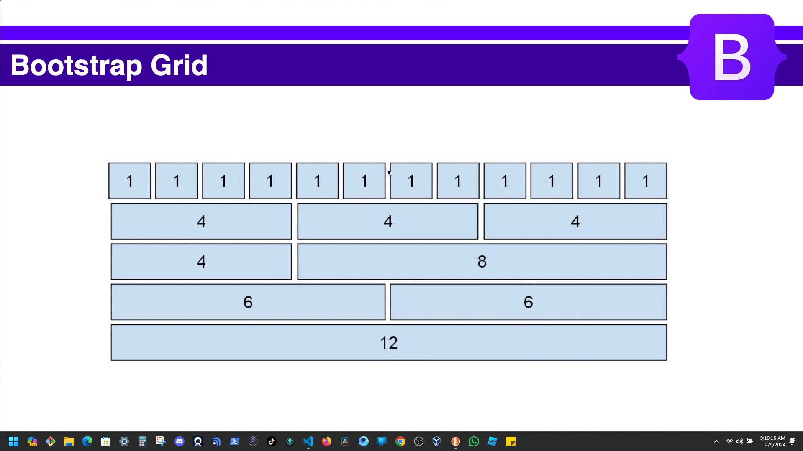

# Section 3: Bootstrap Fundamentals Part 2.
## Bootstrap Grid & Columns.

```HTML
<!DOCTYPE html>
<html lang="en">
  <head>
    <meta charset="UTF-8" />
    <meta http-equiv="X-UA-Compatible" content="IE=edge" />
    <meta name="viewport" content="width=device-width, initial-scale=1.0" />
    <link rel="stylesheet" href="./assets/css/bootstrap.min.css" />
    <title>Bootstrap Sandbox | Bootstrap Grid Columns</title>
  </head>
  <body>
    <div class="container">
      <h1 class="mb-5">Bootstrap Grid Columns</h1>

      <!-- Basic Grid Layout -->
      <div class="row"> <!-- class="row"-->

        <div class="col bg-light border">1 of 2</div><!-- class="col bg-light border"-->
        <div class="col bg-light border">2 of 2</div><!-- class="col bg-light border"-->
      
      </div>
      <div class="row"> <!-- class="row"-->

        <div class="col bg-light border">1 of 3</div><!-- class="col bg-light border"-->
        <div class="col bg-light border">2 of 3</div><!-- class="col bg-light border"-->
        <div class="col bg-light border">3 of 3</div><!-- class="col bg-light border"-->
      
      </div>
      <br /><br />

      <!-- Column Sizes -->
      <div class="container vstack gap-3 text-light">
        <div class="row bg-primary"> <!-- class="row"-->

          <div class="col-1 border">1 of 12</div><!-- class="col bg-light border"-->
          <div class="col-1 border">2 of 12</div><!-- class="col bg-light border"-->
          <div class="col-1 border">3 of 12</div><!-- class="col bg-light border"-->
          <div class="col-1 border">4 of 12</div><!-- class="col bg-light border"-->
          <div class="col-1 border">5 of 12</div><!-- class="col bg-light border"-->
          <div class="col-1 border">6 of 12</div><!-- class="col bg-light border"-->
          <div class="col-1 border">7 of 12</div><!-- class="col bg-light border"-->
          <div class="col-1 border">8 of 12</div><!-- class="col bg-light border"-->
          <div class="col-1 border">9 of 12</div><!-- class="col bg-light border"-->
          <div class="col-1 border">10 of 12</div><!-- class="col bg-light border"-->
          <div class="col-1 border">11 of 12</div><!-- class="col bg-light border"-->
          <div class="col-1 border">12 of 12</div><!-- class="col bg-light border"-->
        
        </div>
        <div class="row bg-secondary"> <!-- class="row"-->
  
          <div class="col-2 border">2 of 12</div><!-- class="col bg-light border"-->
          <div class="col-2 border">4 of 12</div><!-- class="col bg-light border"-->
          <div class="col-2 border">6 of 12</div><!-- class="col bg-light border"-->
          <div class="col-2 border">8 of 12</div><!-- class="col bg-light border"-->
          <div class="col-2 border">10 of 12</div><!-- class="col bg-light border"-->
          <div class="col-2 border">12 of 12</div><!-- class="col bg-light border"-->
        
        </div>
        <div class="row bg-success"> <!-- class="row"-->
  
          <div class="col-3 border">3 of 12</div><!-- class="col bg-light border"-->
          <div class="col-3 border">6 of 12</div><!-- class="col bg-light border"-->
          <div class="col-3 border">9 of 12</div><!-- class="col bg-light border"-->
          <div class="col-3 border">12 of 12</div><!-- class="col bg-light border"-->
        
        </div>
        <div class="row bg-danger"> <!-- class="row"-->
  
          <div class="col-4 border">4 of 12</div><!-- class="col bg-light border"-->
          <div class="col-4 border">8 of 12</div><!-- class="col bg-light border"-->
          <div class="col-4 border">12 of 12</div><!-- class="col bg-light border"-->
        
        </div>
        <div class="row bg-warning"> <!-- class="row"-->
  
          <div class="col-5 border">5 of 12</div><!-- class="col bg-light border"-->
          <div class="col-5 border">10 of 12</div><!-- class="col bg-light border"-->
          <div class="col-2 border">2 of 12</div><!-- class="col bg-light border"-->
        
        </div>
        <div class="row bg-info"> <!-- class="row"-->
  
          <div class="col-6 border">6 of 12</div><!-- class="col bg-light border"-->
          <div class="col-6 border">12 of 12</div><!-- class="col bg-light border"-->
        
        </div>
        <div class="row bg-primary"> <!-- class="row"-->
  
          <div class="col-7 border">7 of 12</div><!-- class="col bg-light border"-->
          <div class="col-5 border">5 of 12</div><!-- class="col bg-light border"-->
        
        </div>
        <div class="row bg-secondary"> <!-- class="row"-->
  
          <div class="col-8 border">8 of 12</div><!-- class="col bg-light border"-->
          <div class="col-4 border">4 of 12</div><!-- class="col bg-light border"-->
        
        </div>
        <div class="row bg-success"> <!-- class="row"-->
  
          <div class="col-9 border">9 of 12</div><!-- class="col bg-light border"-->
          <div class="col-3 border">3 of 12</div><!-- class="col bg-light border"-->
        
        </div>
        <div class="row bg-danger"> <!-- class="row"-->
  
          <div class="col-10 border">10 of 12</div><!-- class="col bg-light border"-->
          <div class="col-2 border">2 of 12</div><!-- class="col bg-light border"-->
        
        </div>
        <div class="row bg-info"> <!-- class="row"-->
  
          <div class="col-11 border">11 of 12</div><!-- class="col bg-light border"-->
          <div class="col-1 border">1 of 12</div><!-- class="col bg-light border"-->
        
        </div>
        <div class="row bg-primary"> <!-- class="row"-->
  
          <div class="col-12 border">12 of 12</div><!-- class="col bg-light border"-->
        
        </div>
      </div>
      
      <br /><br />

      <!-- Responsive Grid -->
      <div class="row bg-info"> <!-- class="row"-->
  
        <div class="col-md-6 border">6 of 12</div> <!-- class="col-md-6 border" -->
        <div class="col-md-6 border">12 of 12</div><!-- class="col-md-6 border"-->
      
      </div>
      <div class="row bg-info"> <!-- class="row"-->
  
        <div class="col-sm-6 col-lg-4 bg-light border">6 of 12</div><!-- class="col-sm-6 col-lg-4 bg-light border""-->
        <div class="col-sm-6 col-lg-4 bg-light border">6 of 12</div><!-- class="col-sm-6 col-lg-4 bg-light border""-->
        <div class="col-sm-6 col-lg-4 bg-light border">6 of 12</div><!-- class="col-sm-6 col-lg-4 bg-light border""-->
        <div class="col-sm-6 col-lg-4 bg-light border">12 of 12</div><!--class="col-sm-6 col-lg-4 bg-light border""-->
      
      </div>
      <br /><br />

      <!-- Row Cols -->
      <div class="row row-cols-3"><!-- class="row row-cols-3" -->
        <div class="col bg-light border">Column</div>
        <div class="col bg-light border">Column</div>
        <div class="col bg-light border">Column</div>
        <div class="col bg-light border">Column</div>
        <div class="col bg-light border">Column</div>
        <div class="col bg-light border">Column</div>
      </div>
      <div class="row row-cols-1 row-cols-md-2 row cols-lg-3"><!-- class="row row-cols-1 row-cols-md-2 row cols-lg-3" -->
        <div class="col bg-light border">Column</div>
        <div class="col bg-light border">Column</div>
        <div class="col bg-light border">Column</div>
        <div class="col bg-light border">Column</div>
        <div class="col bg-light border">Column</div>
        <div class="col bg-light border">Column</div>
      </div>
      <br/><br/>

      <!-- Nesting -->
      <div class="row">
        <div class="col bg-light border pb-3">Column</div>
        <div class="col bg-light border pb-3">Column</div>
        <div class="col bg-light border pb-3"><!-- Nesting -->
          <div class="row">
            <div class="col text-bg-dark">Nest</div>  
            <div class="col text-bg-dark">Nest</div>   
          </div> 
        </div>
      </div>

      <br /><br />

      <!-- Gutters -->
      <div class="row g-0"><!-- class="row g-0/1/2/3/4/5" -->
        <div class="col-md-4">
          <div class="p-3 text-bg-primary">
            Content Item
          </div>
        </div>
        <div class="col-md-4">
          <div class="p-3 text-bg-primary">
            Content Item
          </div>
        </div>
        <div class="col-md-4">
          <div class="p-3 text-bg-primary">
            Content Item
          </div>
        </div>
      </div>

      <br /><br />

      <!-- Offsetting Columns -->
      <div class="row ">
        <div class="col-md-4 offset-4"><!-- class="row offset-4" -->
          <div class="p-3 text-bg-primary">
            Content Item
          </div>
        </div>
        <div class="col-md-4">
          <div class="p-3 text-bg-primary">
            Content Item
          </div>
        </div>
      </div>
      <div class="row">
        <div class="col-md-6 offset-3 border"><!-- class="col-md-6 offset-3"-->
      Hello World  
        </div>
      </div>
      <br /><br />

      <!-- Ordering -->
      <div class="row">
        <div class="col bg-light border order-4">Column 1</div><!-- class="order-4" -->
        <div class="col bg-light border order-3">Column 2</div><!-- class="order-3" -->
        <div class="col bg-light border order-2">Column 3</div><!-- class="order-2" -->
        <div class="col bg-light border order-1">Column 4</div><!-- class="order-1" -->
      </div>
      <!-- Don't go past here -->
    </div>>
    <div style="margin-top: 350px"></div>

    <script src="./assets/js/bootstrap.bundle.min.js"></script>
  </body>
</html>
```
## Flexbox Classes
```HTML
<!DOCTYPE html>
<html lang="en">
  <head>
    <meta charset="UTF-8" />
    <meta http-equiv="X-UA-Compatible" content="IE=edge" />
    <meta name="viewport" content="width=device-width, initial-scale=1.0" />
    <link rel="stylesheet" href="./assets/css/bootstrap.min.css" />
    <title>Bootstrap Sandbox | Flexbox</title>
  </head>
  <body>
    <div class="container">
      <h1 class="mb-5">Flexbox</h1>

      <!-- Basic Flexbox -->
      <div class="d-flex"><!-- class="d-flex" -->
        <div class="text-bg-light p-3">Flex Item</div>
        <div class="text-bg-light p-3">Flex Item</div>
        <div class="text-bg-light p-3">Flex Item</div>
        <div class="text-bg-light p-3">Flex Item</div>
        <div class="text-bg-light p-3">Flex Item</div>
        <div class="text-bg-light p-3">Flex Item</div>
      </div>

      <br /><br />

      <!-- Flex Column -->
      <div class="d-flex flex-column"><!-- class="d-flex flex-column" -->
        <div class="text-bg-dark p-3">Flex Item</div>
        <div class="text-bg-dark p-3">Flex Item</div>
        <div class="text-bg-dark p-3">Flex Item</div>
        <div class="text-bg-dark p-3">Flex Item</div>
        <div class="text-bg-dark p-3">Flex Item</div>
        <div class="text-bg-dark p-3">Flex Item</div>
      </div>

      <br /><br />

      <!-- Using Screen Sizes -->
      <div class="d-flex flex-column flex-md-row"><!-- class="d-flex flex-column flex-md-row" -->
        <div class="text-bg-primary p-3">Flex Item</div>
        <div class="text-bg-primary p-3">Flex Item</div>
        <div class="text-bg-primary p-3">Flex Item</div>
        <div class="text-bg-primary p-3">Flex Item</div>
        <div class="text-bg-primary p-3">Flex Item</div>
        <div class="text-bg-primary p-3">Flex Item</div>
      </div>

      <br /><br />

      <!-- Flex Wrap -->
      <div class="d-flex flex-wrap"><!-- class="d-flex flex-wrap" -->
        <div class="text-bg-success p-3">Flex Item</div>
        <div class="text-bg-success p-3">Flex Item</div>
        <div class="text-bg-success p-3">Flex Item</div>
        <div class="text-bg-success p-3">Flex Item</div>
        <div class="text-bg-success p-3">Flex Item</div>
        <div class="text-bg-success p-3">Flex Item</div>
        <div class="text-bg-success p-3">Flex Item</div>
      </div>

      <br /><br />

      <!-- Justify Content -->
      <div class="d-flex justify-content-end"><!-- class="d-flex justify-content-end" -->
        <div class="text-bg-dark p-3">Flex Item</div>
        <div class="text-bg-dark p-3">Flex Item</div>
        <div class="text-bg-dark p-3">Flex Item</div>
      </div>

      <br /><br />

      <div class="d-flex justify-content-around"><!-- class="d-flex justify-content-around" -->
        <div class="text-bg-dark p-3">Flex Item</div>
        <div class="text-bg-dark p-3">Flex Item</div>
        <div class="text-bg-dark p-3">Flex Item</div>
      </div>

      <br /><br />

      <div class="d-flex justify-content-between"><!-- class="d-flex justify-content-between" -->
        <div class="text-bg-dark p-3">Flex Item</div>
        <div class="text-bg-dark p-3">Flex Item</div>
        <div class="text-bg-dark p-3">Flex Item</div>
      </div>

      <br /><br />

      <!-- Align Items class="" -->
      <div class="d-flex flex-column align-items-end" style="height: 300px"><!-- class="d-flex flex-column align-items-end" -->
        <div class="text-bg-light p-3">Flex Item</div>
        <div class="text-bg-light p-3">Flex Item</div>
        <div class="text-bg-light p-3">Flex Item</div>
      </div>

      <div class="d-flex flex-column align-items-center" style="height: 300px"><!-- class="d-flex flex-column align-items-center" -->
        <div class="text-bg-primary p-3">Flex Item</div>
        <div class="text-bg-primary p-3">Flex Item</div>
        <div class="text-bg-primary p-3">Flex Item</div>
      </div>

      <br /><br />

      <!-- Align Self -->
      <div class="d-flex flex-column" style="height: 300px">
        <div class="text-bg-primary p-3 align-self-center" >Flex Item</div><!-- class=" align-self-center" -->
        <div class="text-bg-primary p-3 align-self-end">Flex Item</div><!-- class=" align-self-end" -->
        <div class="text-bg-primary p-3">Flex Item</div>
      </div>

      <br /><br />

      <!-- Flex Grow -->
      <div class="d-flex">
        <div class="text-bg-primary p-3 flex-grow-1">Flex Item</div><!-- class="flex-grow-1" -->
        <div class="text-bg-dark p-3">Flex Item</div>
        <div class="text-bg-dark p-3">Flex Item</div>
      </div>

      <!-- Don't go past here -->
    </div>
    <div style="margin-top: 350px"></div>

    <script src="./assets/js/bootstrap.bundle.min.js"></script>
  </body>
</html>
```
## Cards
```HTML
<!DOCTYPE html>
<html lang="en">
  <head>
    <meta charset="UTF-8" />
    <meta http-equiv="X-UA-Compatible" content="IE=edge" />
    <meta name="viewport" content="width=device-width, initial-scale=1.0" />
    <link rel="stylesheet" href="./assets/css/bootstrap.min.css" />
    <title>Bootstrap Sandbox | Cards</title>
  </head>
  <body>
    <div class="container">
      <h1 class="mb-5">Cards</h1>

      <!-- Basic Text Card -->
      <div class="card" style="width: 25rem">   <!-- class="card" -->
        <div class="card-body">                 <!-- class="card-body" -->
          <h5 class="card-title">Card Title</h5><!-- class="card-title"-->
          <div class="card-text">               <!-- class="card-text" -->
            Lorem ipsum dolor sit amet consectetur adipisicing elit. Dolor facilis expedita ut tempore praesentium, dolores rem culpa repellendus sunt illum id mollitia modi totam neque alias aspernatur perferendis aut quas.
          </div>
        </div>
      </div>

      <br /><br />

      <!-- Card With Image -->
      <div class="card" style="width: 25rem">   
        <!-- class="card-img-top"-->
        <div class="card-body">                 
          <h5 class="card-title">Card Title</h5>
          <div class="card-text">               
            Lorem ipsum dolor sit amet consectetur adipisicing elit. Dolor facilis expedita ut tempore praesentium, dolores rem culpa repellendus sunt illum id mollitia modi totam neque alias aspernatur perferendis aut quas.
          </div>
        </div>
      </div>

      <br /><br />

      <!-- Header & Footer -->
      <div class="card" style="width: 25rem">
        <div class="card-header">Card Header</div><!-- class="card-header" -->
        <div class="card-body">                 
          <h5 class="card-title">Card Title</h5>
          <div class="card-text">               
            Lorem ipsum dolor sit amet consectetur adipisicing elit. Dolor facilis expedita ut tempore praesentium, dolores rem culpa repellendus sunt illum id mollitia modi totam neque alias aspernatur perferendis aut quas.
          </div>
        </div>
        <div class="card-footer">Card Footer</div><!-- class="card-footer" -->
      </div>
      <br /><br />

      <!-- List Group Card -->

      <br /><br />
      <!-- Navigation -->

      <br /><br />

      <!-- Horizontal Card -->

      <br /><br />

      <!-- Grid Columns & Colors -->
      <div class="row">
        <div class="col-md-3">
          <div class="card" >
            <div class="card-body">                 
              <h5 class="card-title">Card Title</h5>
              <div class="card-text">               
                <p>Lorem ipsum dolor sit amet consectetur adipisicing elit. Dolor facilis expedita ut tempore praesentium, dolores rem culpa repellendus sunt illum id mollitia modi totam neque alias aspernatur perferendis aut quas.</p>
              </div>
            </div>
          </div>
        </div><!-- card 1 end-->
        <div class="col-md-3">
          <div class="card" >
            <div class="card-body">                 
              <h5 class="card-title">Card Title</h5>
              <div class="card-text">               
                <p>Lorem ipsum dolor sit amet consectetur adipisicing elit. Dolor facilis expedita ut tempore praesentium, dolores rem culpa repellendus sunt illum id mollitia modi totam neque alias aspernatur perferendis aut quas.</p>
              </div>
            </div>
          </div>
        </div><!-- card 2 end-->
        <div class="col-md-3">
          <div class="card" >
            <div class="card-body">                 
              <h5 class="card-title">Card Title</h5>
              <div class="card-text">               
                <p>Lorem ipsum dolor sit amet consectetur adipisicing elit. Dolor facilis expedita ut tempore praesentium, dolores rem culpa repellendus sunt illum id mollitia modi totam neque alias aspernatur perferendis aut quas.</p>
              </div>
            </div>
          </div>
        </div><!-- card 3 end-->
        <div class="col-md-3">
          <div class="card" >
            <div class="card-body">                 
              <h5 class="card-title">Card Title</h5>
              <div class="card-text">               
                <p>Lorem ipsum dolor sit amet consectetur adipisicing elit. Dolor facilis expedita ut tempore praesentium, dolores rem culpa repellendus sunt illum id mollitia modi totam neque alias aspernatur perferendis aut quas.</p>
              </div>
            </div>
          </div>
        </div><!-- card 4 end-->
      </div><!--row end-->

      <br /><br />

      <!-- Card Group -->

      <br /><br />

      <!-- Placeholders -->

      <!-- Don't go past here -->
    </div>
    <div style="margin-top: 350px"></div>

    <script src="./assets/js/bootstrap.bundle.min.js"></script>
  </body>
</html>
```
# Template
<table>
    <thead>
    </thead>
    <tbody>
      <tr>
        <td></br> 
        </td>
        <td>
          <ul>
            <li></li>
            <li></li>
            <li></li>
            <li></li>
          </ul>
      </td>
      </tr>
    </tbody>
</table> 

```HTML

```
<table>
    <thead>
    </thead>
    <tbody>
      <tr>
        <td>Pomodoro</br> 
        </td>
        <td>
          <ul>
            <li>1 - 2/10/2024</li>
            <li>2 - 2/10/2024</li>
            <li>3 - 2/11/2024</li>
            <li>4 - 2//2024</li>
          </ul>
      </td>
      </tr>
      <tr>
        <td>Pomodoro</br> 
        </td>
        <td>
          <ul>
            <li>1 - 2/9/2024</li>
            <li>2 - 2/9/2024</li>
            <li>3 - 2/9/2024</li>
            <li>4 - 2/9/2024</li>
          </ul>
      </td>
      </tr>
      <tr>
        <td>Pomodoro</br> 
        </td>
        <td>
          <ul>
            <li>1 - 2//2024</li>
            <li>2 - 2//2024</li>
            <li>3 - 2//2024</li>
            <li>4 - 2//2024</li>
          </ul>
      </td>
      </tr>
    </tbody>
</table> 