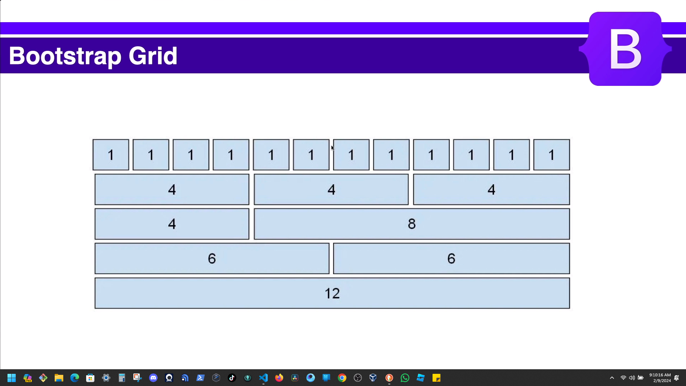

# Section 4: Dynamic JavaScript Components.
## Bootstrap Grid & Columns.


# Template
<table>
    <thead>
    </thead>
    <tbody>
      <tr>
        <td></br> 
        </td>
        <td>
          <ul>
            <li></li>
            <li></li>
            <li></li>
            <li></li>
          </ul>
      </td>
      </tr>
    </tbody>
</table> 

```HTML

```
<table>
    <thead>
    </thead>
    <tbody>
      <tr>
        <td>Pomodoro</br> 
        </td>
        <td>
          <ul>
            <li>1 - 2/9/2024</li>
            <li>2 - 2/9/2024</li>
            <li>3 - 2/9/2024</li>
            <li>4 - 2/9/2024</li>
          </ul>
      </td>
      </tr>
    </tbody>
</table> 